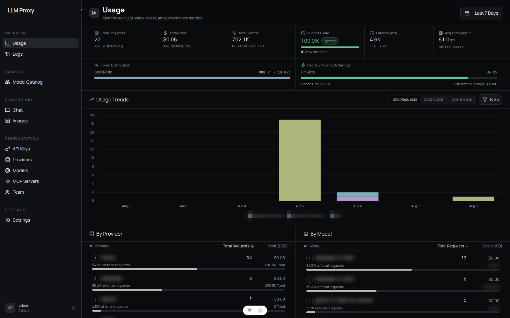
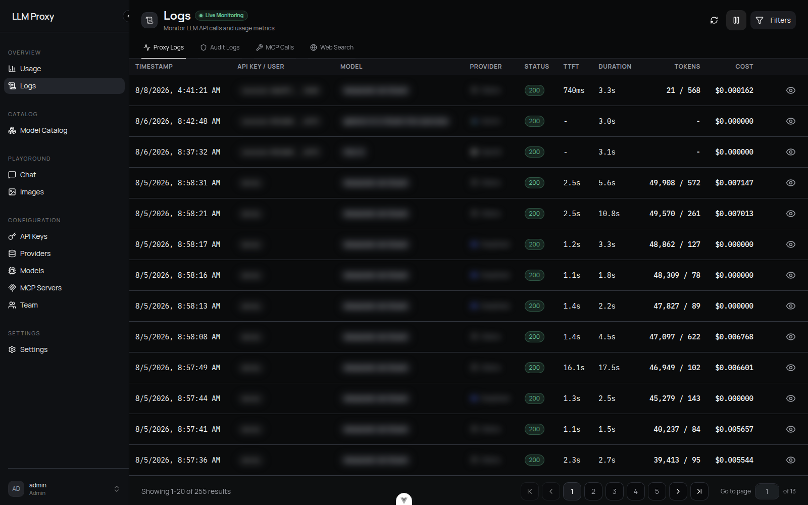
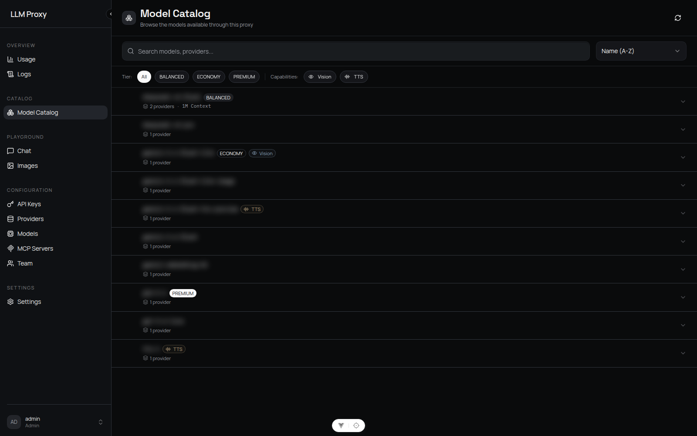
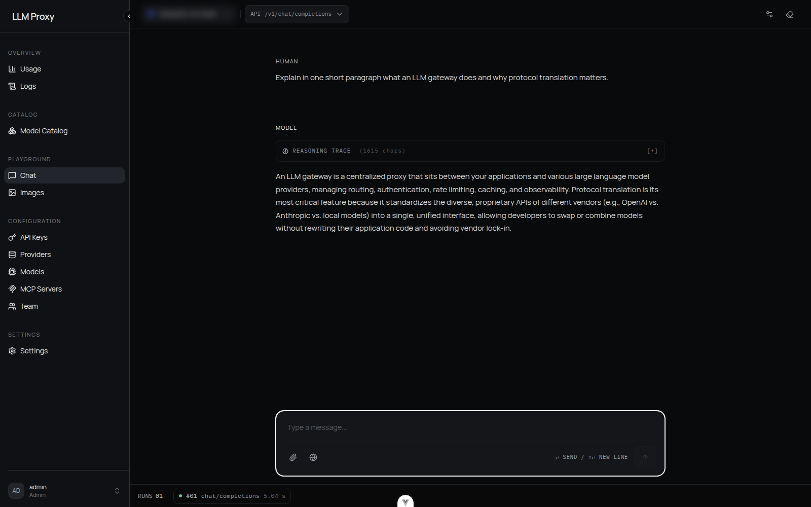
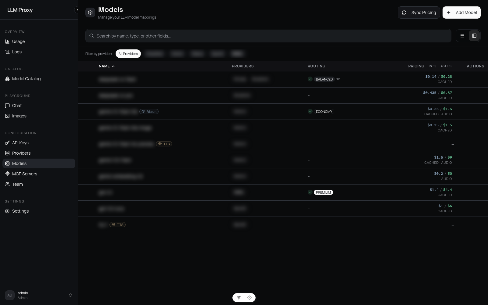
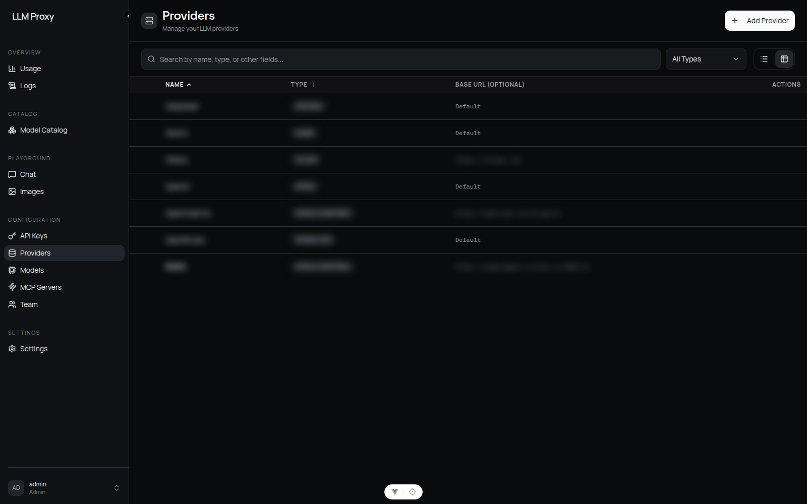
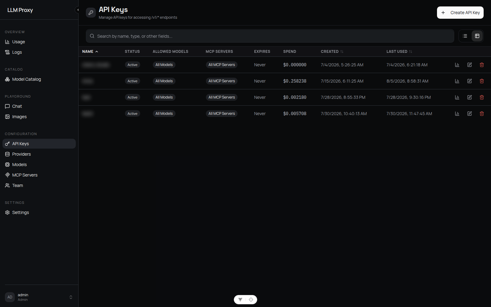
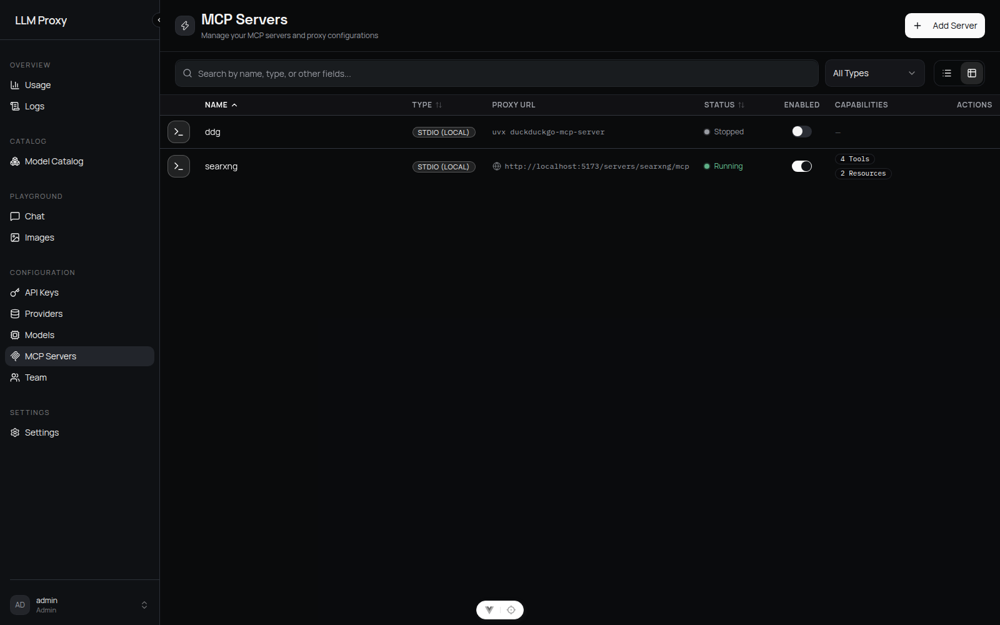
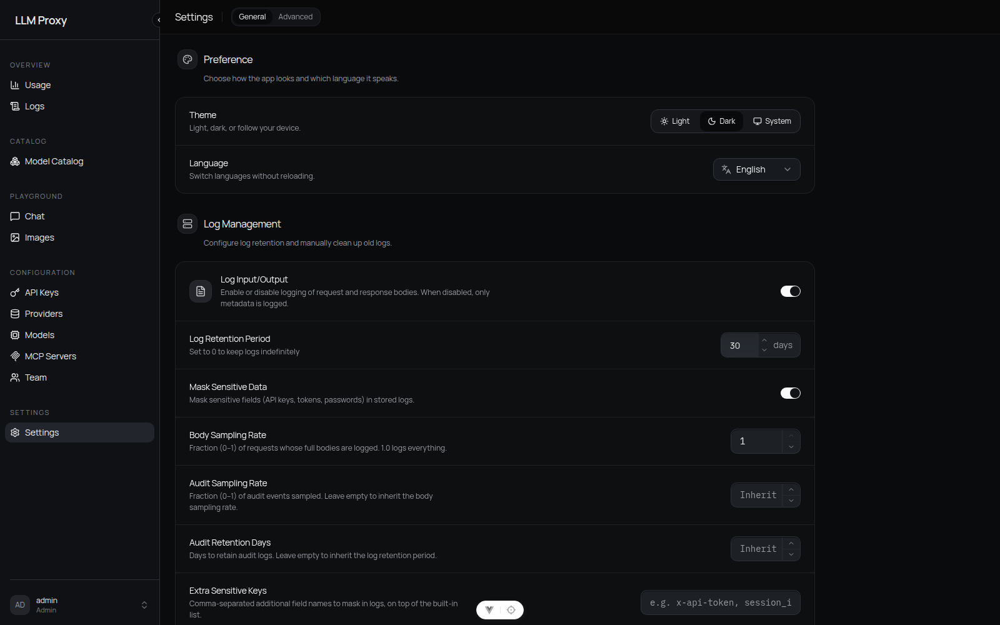

# LLM Proxy

> One gateway for every LLM. Any client protocol in, any provider out — with smart routing, cost control, and a full admin console.

[](https://python.org)
[](https://github.com/zwldarren/llm-proxy/pkgs/container/llm-proxy)
[](https://github.com/astral-sh/ruff)
[](LICENSE)



LLM Proxy is a self-hostable LLM API gateway. Point your existing OpenAI or Anthropic SDK at it and instantly gain access to every configured provider — with automatic failover, cost-aware routing, per-key budgets, request logging, and an admin dashboard to manage it all without restarts.

## Why LLM Proxy?

- **Write once, run on any provider** — Your app speaks one protocol (OpenAI *or* Anthropic); the proxy translates bidirectionally to every upstream. Switch providers by changing a model name, not your code.
- **Never hard-down** — Priority-based provider fallback with circuit breakers retries the next provider automatically when one fails or rate-limits.
- **Route by intent, not by model ID** — Virtual models `auto` / `fast` / `best` classify each request and pick the right real model for cost and quality.
- **Know exactly what you spend** — Per-token billing (input / output / cached / audio / image rates) with live usage analytics, plus per-key USD budgets that cut off spend before the bill surprises you.
- **Everything is operable from the UI** — Providers, models, pricing, keys, teams, logs, tracing, security policy: all hot-reloaded from the dashboard. No config-file archaeology, no restarts.

## Features

### 🔀 Protocol Translation

Speak any client protocol; the proxy normalizes it to a unified internal model and renders it for whatever provider serves the request — including SSE streaming, tool calls, and reasoning traces.

| Protocol | Endpoint |
| --- | --- |
| **OpenAI Chat Completions** | `POST /v1/chat/completions` |
| **OpenAI Responses API** | `POST /v1/responses` (with `GET`/`DELETE /v1/responses/{id}`) |
| **Anthropic Messages** | `POST /v1/messages` |
| **OpenAI-compatible utilities** | `/v1/embeddings` · `/v1/images/generations` · `/v1/images/edits` · `/v1/audio/speech` · `/v1/audio/transcriptions` · `/v1/audio/translations` · `/v1/models` |

### 🧭 Smart Routing & Resilience

- **Virtual models** — Route to `auto`, `fast`, or `best` and let the built-in keyword-free classifier (structural + Unicode + n-gram features, no LLM call) pick a real model by complexity, cost, and capability.
- **Cost-aware selection** — Routing tiers (`ECONOMY` / `BALANCED` / `PREMIUM`) with bandit-style exploration that learns from real outcomes.
- **Fallback chains & circuit breakers** — Per-provider attempt tracking, automatic retries on failure, and breakers that stop hammering a sick upstream.
- **Keepalive heartbeats** — Whitespace heartbeats keep slow non-streaming requests alive behind CDNs (avoids Cloudflare 524s).

### 🔍 Built-in Web Search

Intercept `web_search` tool calls from any client and answer them through your own search backend (SearXNG or Ollama) — results are injected back in the client's native format, Anthropic-compatible included. Every model becomes web-aware without provider-specific tooling.

### 🛠 MCP Tool Bridging

Attach [Model Context Protocol](https://modelcontextprotocol.io) servers (stdio or HTTP) and expose their tools to any model through any client protocol. Per-key MCP allowlists plus a security policy (command/env allowlists, private-IP and dangerous-command blocking) keep it safe. MCP servers are proxied under `/servers/*`.

### 💰 Cost Control & Billing

- **Per-token pricing** per model: input, output, cached-input, audio, and image rates; one-click pricing sync.
- **Per-API-key budgets** — daily / weekly / monthly USD windows with automatic enforcement and manual reset.
- **Token counting** — tiktoken-based counting with cache-hit tracking and estimated savings on the dashboard.

### 📊 Observability

- **Live request logs** — Every call with TTFT, duration, tokens, cost, status; filter by key, user, model, provider, or status. Live-monitoring mode included.
- **Usage analytics** — Trends, provider/model breakdowns, token distribution, cache efficiency, latency and throughput percentiles over 7/30/90 days.
- **Audit log with integrity verification** — Tamper-evident audit chain, plus Langfuse tracing integration and per-user self-service tracing.
- **Privacy controls** — Log retention periods, body/audit sampling rates, and sensitive-field masking (API keys, tokens, passwords, plus your own extra keys).

### 🔐 Security & Access Control

- **Multi-user teams** — `admin` / `viewer` roles: viewers manage their own API keys and see only their own logs; admins see everything. First-run setup screen, bcrypt password policy, JWT sessions, forced password change for admin-created accounts, per-user model allowlists, per-key budgets and rate limits.
- **API keys with guardrails** — Per-key model allowlists, MCP allowlists, rate limits (requests/min), expiry, and spend tracking.
- **Abuse protection** — Sliding-window rate limiting (in-memory or Redis), login lockout policy, HSTS, request-size limits, trusted-proxy-aware client IP resolution.
- **Secrets handled for you** — JWT secret and API-key encryption key are auto-generated and persisted on first run; override via env only if you want to.

### 🖥 Admin Dashboard & Playgrounds

A dark-first Vue 3 console (English & 中文, light/dark/system themes):

- **Usage** — the dashboard above: spend, tokens, success rate, latency, throughput, cache savings
- **Logs** — live request inspection with full request/response bodies
- **Model Catalog** — browse every reachable model with tiers, capabilities, context sizes, and pricing
- **Chat & Images playgrounds** — an API test console to verify routing, streaming TTFT, tool calls, vision input, and image generation against any configured model
- **Configuration** — providers, model mappings & pricing, API keys, MCP servers, team, and server-wide policy sections (logging, web search, tracing, smart routing, resilience, rate limits, CORS, circuit breaker, MCP security…), all hot-reloaded

<details>
<summary><b>📷 More screenshots</b></summary>

| | |
| --- | --- |
|  |  |
|  |  |
|  |  |
|  |  |

</details>

## Quick Start

### Option A — Docker Compose (recommended)

```bash
git clone https://github.com/zwldarren/llm-proxy.git
cd llm-proxy

# Set a database password, then start everything
echo "POSTGRES_PASSWORD=$(openssl rand -hex 16)" > .env
docker compose up -d
```

This starts the proxy (prebuilt image), PostgreSQL, and Redis. Open **http://localhost:8080** — the first-run setup screen creates your admin account, then add a provider and you're live.

### Option B — From source

Prerequisites: Python 3.14+, [uv](https://docs.astral.sh/uv/), and [bun](https://bun.sh) (to build the frontend).

```bash
git clone https://github.com/zwldarren/llm-proxy.git
cd llm-proxy
uv sync

# Build the frontend once, then run
uv run llm-proxy --build-frontend
```

The server starts on `http://localhost:8080` (override with `--host`/`--port`). SQLite is used by default; set `DATABASE_URL` for PostgreSQL.

## Using the API

Create an API key in **Configuration → API Keys**, then point any SDK at the proxy:

```bash
curl http://localhost:8080/v1/chat/completions \
  -H "Authorization: Bearer sk-your-proxy-key" \
  -H "Content-Type: application/json" \
  -d '{"model": "auto", "messages": [{"role": "user", "content": "Hello!"}]}'
```

```python
# OpenAI SDK — only base_url changes
from openai import OpenAI

client = OpenAI(base_url="http://localhost:8080/v1", api_key="sk-your-proxy-key")
client.chat.completions.create(model="gpt-5.6-luna", messages=[...])
```

```python
# Anthropic SDK — same key, same gateway
from anthropic import Anthropic

client = Anthropic(base_url="http://localhost:8080", api_key="sk-your-proxy-key")
client.messages.create(model="deepseek-v4-flash", max_tokens=1024, messages=[...])
```

`model="auto"` (or `fast` / `best`) engages smart routing; a concrete model name goes straight to its configured provider with fallback.

## Configuration

Configuration is split into two channels:

- **Admin dashboard (database-backed, hot-reloaded)** — all runtime behavior:
  providers, models, pricing, logging (retention, masking, sampling, sensitive
  keys), security & rate limiting (lockout policy, HSTS, request body size,
  rate-limit thresholds), response keepalive, CORS origins, web search,
  smart routing, request policy, resilience, tracing, and MCP security.
  Changes apply immediately without a restart.
- **Environment variables (startup-time only, see `.env.example`)** — database
  and Redis connections, HTTP client pool, uvicorn options, `LOG_LEVEL`,
  `TRUSTED_PROXIES`, batch-writer tuning, and optional `JWT_SECRET` /
  `ENCRYPTION_KEY` overrides (when unset, both are auto-generated and persisted
  in the database on first run).

### Key Environment Variables

| Variable | Default | Description |
| --- | --- | --- |
| `DATABASE_URL` | SQLite in the user data dir | Database connection string (PostgreSQL supported) |
| `REDIS_ENABLED` / `REDIS_URL` | `false` / `redis://localhost:6379` | Redis for rate limiting, caching, and log shipping |
| `JWT_SECRET` | auto-generated | Explicit override for the JWT signing secret |
| `ENCRYPTION_KEY` | auto-generated | Explicit override for the API-key encryption key |
| `TRUSTED_PROXIES` | private/loopback ranges | Networks trusted to set `X-Forwarded-For` |
| `LOG_LEVEL` | `INFO` | Logging pipeline verbosity |

## Development

```bash
# Start backend + frontend dev servers concurrently (requires bun)
uv run llm-proxy-dev
```

This starts:

- Backend uvicorn with `--reload` on port `9911`
- Frontend Vite dev server on `0.0.0.0:5173`, proxying API to the backend

### Verification

```bash
uv run ruff check --fix && uv run ruff format && uv run ty check && uv run pytest
```

### Stack

**Backend** — Python 3.14, FastAPI, SQLAlchemy + Alembic (SQLite/PostgreSQL), Redis (optional), httpx. **Frontend** — Vue 3, Vite, TypeScript, Tailwind CSS v4, shadcn-vue, Pinia, vue-i18n.

## License

MIT
