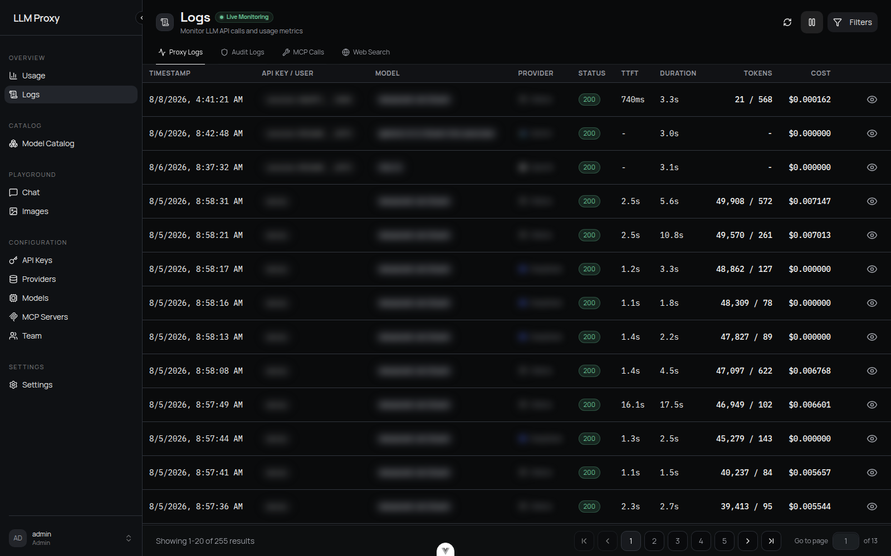

# Logs, Usage & Tracing

Every request through the proxy produces a log row, a usage record, and — when it is
an administrative or security event — a tamper-evident audit entry.

## Proxy Logs

**Logs → Proxy Logs** lists one row per request with timestamp, key/user, model,
provider, status, TTFT, duration, tokens, and cost. Open a row for the full request
and response bodies, headers, retry/fallback details, and (for smart-routed requests)
the routing decision.

| Field | Notes |
| --- | --- |
| `status_code` | Upstream or proxy status. `499` means the client disconnected mid-request and the upstream call was cancelled |
| `ttft_ms` | Time to first token (streaming) |
| `response_time_ms` | Total duration |
| Token counts | Prompt, completion, total; cache creation/read; cached prompt; audio in/out |
| `cost_usd` / `cache_savings_usd` | Billed cost and the estimated saving from cache reads |
| `log_metadata` | `fallback_attempts`/`fallback_count`/`fallback_providers`, `retry_attempts`/`retry_count`, routing fields, `provider_model_name` |
| `client_ip`, `user_agent`, `auth_method` | Attribution, computed through trusted-proxy resolution |
| Bodies | JSON, or `{"$binary": true, "size": N}` for binary payloads. Streaming responses are reassembled into the protocol's non-streaming JSON unless **Log Raw Stream** is on |

**Filtering** (`GET /api/logs`): page or cursor pagination (max 200 per page), free-text
`search`, date range, exact status or status range, model, provider, user, API key,
endpoint, and log type. Non-admins are automatically scoped to their own rows.

### Privacy controls

Configured in [Settings → Log Management](settings.md#log-management):

- **Bodies** (`log_input_output`, default **off**) is the master switch for persisting
  request/response bodies. Off, every row is still written (status, tokens, cost,
  routing, audit metadata, and headers) but every content payload is replaced by
  `{"_bodies_disabled": true}`: the request and response bodies, **upstream error bodies**
  and messages (`error_details.response_body` / `original_error` / `detail`, plus the
  error text recorded in each **fallback/retry attempt**), and **MCP arguments/results**
  and **web-search queries/results** in `log_metadata`. It is the master switch, not a sampling
  knob: `x-log-full: true` cannot re-enable bodies for one request — turn it on in
  Settings → Log Management (and back off when done) to inspect payloads.
  The row's free-text `error_message` and `error_stack_trace` columns are kept: they
  are the diagnostic reason (rate limit vs budget vs upstream failure) and the rejection
  rows below depend on that text. The upstream error payload they can echo lives in
  `log_metadata.error_details`, which *is* scrubbed.
- **Sampling** (`sampling_rate`, default 1.0) limits **body capture** for requests that
  do have bodies enabled: sampled-out bodies are stored as `{"_sampled_out": true}` (a
  distinct marker, so the UI never reports "sampled out" when bodies are simply disabled)
  while metadata is still recorded. `x-log-full: true` forces full capture for one request.
- **Raw stream** (`log_raw_stream`, default off) controls how a *streaming* response is
  stored. Off, the accumulated content blocks are reassembled through the protocol
  serializer into the exact JSON a non-streaming call would have returned — the SSE
  envelope (`id`, `model`, `object`, `choices[0].index`, …) repeats on every delta, so
  the reassembled body is an order of magnitude smaller, and unlike the SSE text it is
  maskable and searchable. Measured on representative streams: ~45× smaller for Chat
  Completions, ~20× for Anthropic. On, the raw SSE frames are stored verbatim as a
  string. `x-log-full: true` forces raw for one request.
  The **native-passthrough** tier (the default for OpenAI-compatible providers on the
  `openai` protocol, and for Anthropic/OpenResponses-native providers) forwards
  upstream frames without running the content transformer. It still logs the
  reassembled body — each protocol rebuilds it from its own frames: native Chat
  Completions frames *are* `chat.completion.chunk` payloads, native Anthropic frames
  rebuild the message block by block, and a native Responses stream carries the whole
  response on its terminal event. Raw frames are kept only where there is no way to
  rebuild the body: a native tier whose protocol transformer cannot, and the generic
  streams (image generation and edit) whose payloads carry no content model. A stream
  whose body cannot be rebuilt stores `{"streaming": true, "_assembled": false}`, and
  nothing is stored when the request was sampled out or `log_input_output` is off.
- **Body cap** (`max_logged_body_bytes`, default `1048576` = 1 MiB; `0` = unlimited) limits
  body **size** at write time: a request or response body bigger than the cap is stored as
  `{"_truncated": true, "size": N}` (the original serialized size in bytes) instead of the
  payload. Since the cap is applied when the log row is built, it also truncates requests
  that forced capture with `x-log-full: true`; metadata is always recorded.
- **Masking** (`mask_sensitive_data`, default on) replaces credentials in headers,
  bodies, and MCP/tool arguments. Values ≤ 8 chars become `***`; longer values keep
  their first 3 and last 4 characters. Add your own field names via **Extra Sensitive Keys**.
- **Retention** (`log_retention_days`, default 30; `0` = forever) is enforced by a
  sweep per log type that runs once a day. The sweep deletes in bounded
  batches, looping until exhausted — including request logs and usage
  records — so it never holds a single long write lock on a large store. A sweep that
  deleted rows is followed by a bounded `PRAGMA incremental_vacuum` and
  `PRAGMA wal_checkpoint(TRUNCATE)`, trimming the WAL and reusing freed pages on
  SQLite databases created with `auto_vacuum=INCREMENTAL`; existing database files
  keep their mode and reclaim space only via a one-time `VACUUM` (see
  [Databases](../deployment/databases.md)). Audit retention can be set separately.

### Rejected requests

Requests rejected before the pipeline still leave a row, so an API key whose traffic is
being refused is not invisible in Logs:

- Invalid API keys and IP lockouts are recorded as AUDIT rows by the auth middleware.
- Per-key **rate limits** (429), **budget caps** (429/503) and **model restrictions**
  (403) are recorded too. These rows carry the status and reason but deliberately **no
  body**: they are the path a client can trigger cheaply, so they must not become a
  write amplifier for prompt content. Repeated rejections for the same key and status
  are collapsed into one row per short window, so a client stuck in a retry loop cannot
  flood the log either; the collapsed attempts are reported in that row's metadata as
  `suppressed_since_last`. The window is per worker, so a multi-worker deployment can
  write up to one row per worker per window.
- Headers are kept on body-less rows (they are masked metadata), so a rejected or
  body-less request stays diagnosable.

### Durability

Logs and usage are written through in-process queues with background batch writers.
A full queue **drops** records (audit writes log an error instead); write failures
retry with backoff and open a breaker after 5 consecutive failures. On shutdown the
queues are drained (bounded at 5 s). Audit rows use a dedicated writer so endpoint
traffic cannot crowd them out.

## Usage analytics

The **Usage** dashboard and `GET /api/logs/usage-stats` aggregate:

- Summary: total cost, requests, input/output tokens, success rate, average response
  time, average TTFT, average tokens/second, cache creation/read tokens, cache savings.
- Breakdowns by provider and by model, plus a daily series.

Metrics come from the dedicated `usage_records` table, which is pruned on the same
retention window as the logs and survives the manual **Cleanup Logs** action; request
counts and success rate come from `request_logs` when available.
Averages are the only latency/throughput statistics reported — no percentiles. Cache
savings require a `cached_read_cost_per_1m` price on the model; without it the metric
is skipped with a warning.

## Audit Logs

Administrative and security events (logins, member and key management, provider key
reveals, and every non-`/v1/` admin operation) are written to a **hash-chained** audit
log — each row's hash includes the previous row's, so removing or editing history is
detectable.

- **Chain**: `content_hash` = SHA-256 over a canonical JSON dump of the event,
  outcome, resource, model/provider, cost, tokens, and bodies. The stored link hash is
  SHA-256 of `"{sequence}:{content_hash}:{previous_hash}"`, with `GENESIS` as the seed
  of the chain.
- **Verify**: Logs → Audit Logs → **Verify Integrity**
  (`GET /api/logs/audit/verify-integrity`, admin only, optional sequence range)
  recomputes every hash and checks the linkage, returning `valid`, `verified_count`,
  and any errors.

Audit rows are admin-only in the console and API.

## MCP Calls and Web Search tabs

| Tab | Contents |
| --- | --- |
| **MCP Calls** | One row per MCP operation: server, operation, resource type/name, arguments and result summary (masked), status, duration |
| **Web Search** | One row per intercepted search: query, provider, status, result count, max uses vs. current use |

## Tracing

Tracing is **per user** (Settings → General → Tracing) and currently supports
**Langfuse** plus the always-on internal audit handler. There is no global tracing
configuration and no OTLP exporter in v0.2.3.

When enabled, each request exports one generation observation:

- Name and model from the request, with model parameters.
- `input` = messages (or `{tools, messages}` when tools are present); `output` = the
  assistant message with tool calls separated out.
- `usage_details` as **mutually exclusive** buckets: `input`/`output` exclude the
  cache, audio and reasoning detail counts, which are emitted under their own
  buckets (`cache_read_input_tokens`, `cache_creation_input_tokens`,
  `input_audio_tokens`, `output_audio_tokens`, `output_reasoning_tokens`) so
  Langfuse's inferred cost does not double-count them. `cost_details.total` is the
  proxy-computed (or provider-reported) USD total.
- A `tool` observation per tool call the model requested.
- Trace-level attributes via `propagate_attributes`: trace name, **user id** and
  **session id**. Metadata carries the request id, trace id, provider, endpoint,
  latency, TTFT, token details not used as buckets, cache savings, and fallback/retry
  information.

Correlate a trace with a request by sending `x-langfuse-trace-id` (or `x-trace-id`);
when it is a canonical 32-character hex Langfuse trace id the proxy's generation is
nested inside that trace, otherwise the proxy starts its own trace. The proxy echoes a
trace id header on responses and both headers are CORS-exposed. A generated trace id is
also a 32-character hex id, so the `trace_id` in the request logs matches the Langfuse
trace id exactly.

## Related

- [Settings](settings.md#log-management) — retention, masking, sampling
- [Cost Control](../guides/cost-control.md) — turning usage data into budgets
